### Procedure

1. Open the simulator window. Read the general instructions on how to use this tool before starting the simulation.

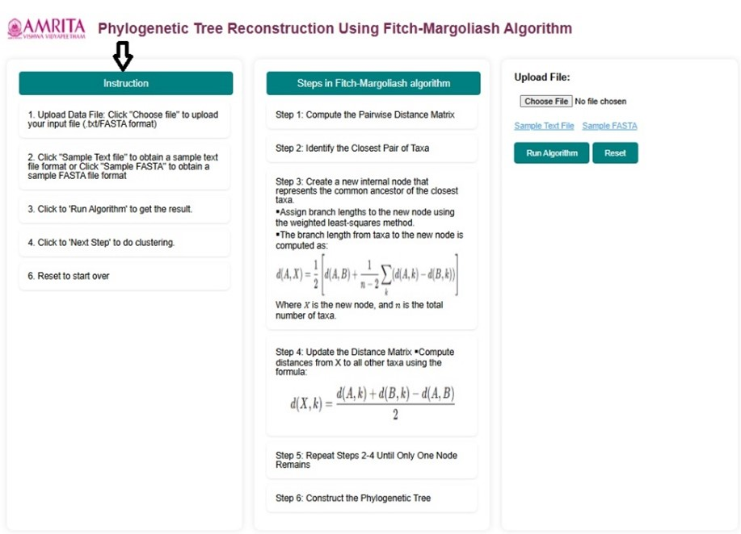
&nbsp;

 
2. Read and understand the steps followed in the Margoliash Algorithm.

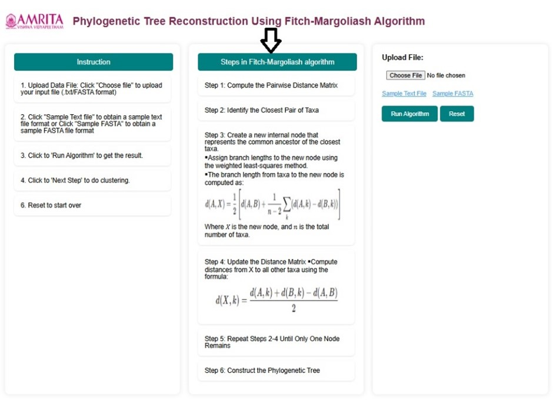
&nbsp;

  
3. To start the simulation, the user must upload a DNA Multiple sequence alignment in .txt format or FASTA format. Click the "Choose file" button and upload the user's input file of interest. 

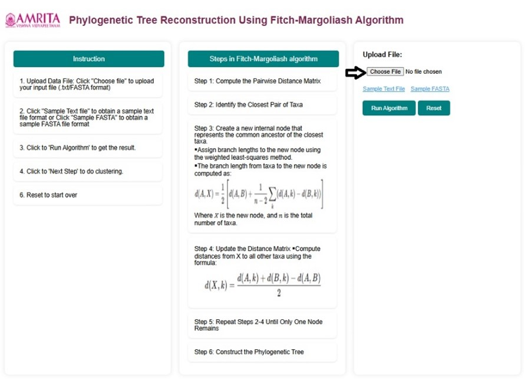
&nbsp;

  
4. To practice the simulator, instead of step 3, users can download sample data provided in the GUI. Sample Text File and Sample FASTA are provided as examples. Click on either of the sample files to proceed with the simulator. Here, as an example, Sample Text file is used to study Phylogenetic Tree Reconstruction Using the Fitch-Margoliash Algorithm. 

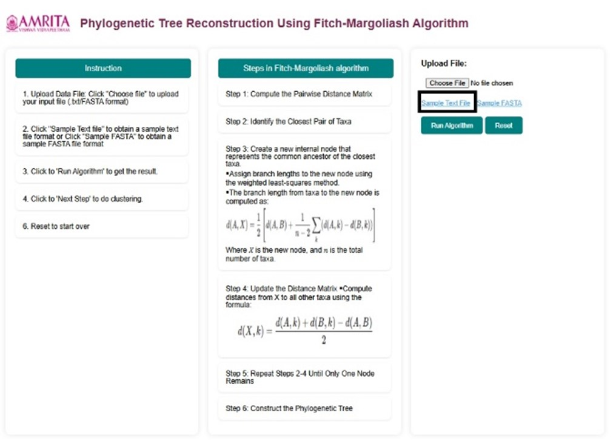
&nbsp;

  
5. The sample text file will get downloaded in a specific selected folder on the user's personal computer. Upload this file to continue the simulation.

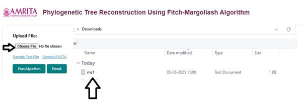
&nbsp;

  
6. Click on Run algorithm to proceed the experiment.

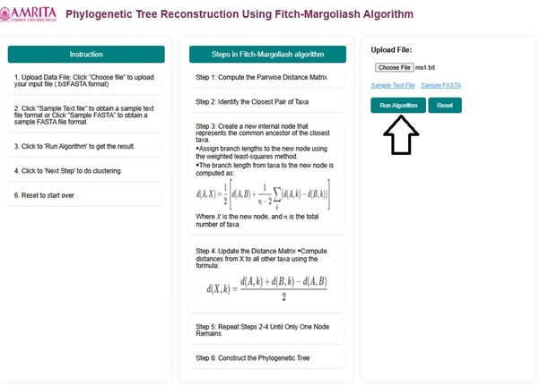
&nbsp;

  
7. In the user interface, users can observe the sequence labels. The sequence labels correspond to the multiple sequence alignment of the DNA sequence provided as input data. 

&nbsp;

 
8. Pairwise distance calculation procedure and construction of distance matrix steps are displayed in the GUI. Initial matrix is created where users can observe that d (B, D) = 0.4000 has the shortest distance. 

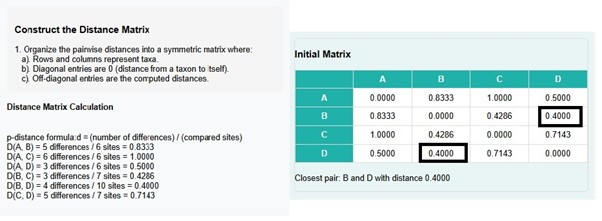
&nbsp;

 
9. Next click on the Next Step Button to proceed.

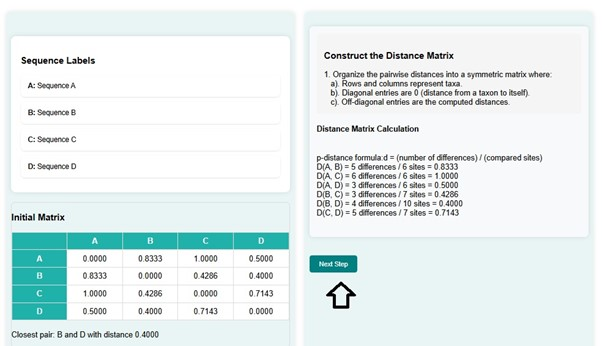
&nbsp;

  
10. It will display the matrix with newly calculated distances. The shortest distance is for d(C, B-D) , that is 0.3714. Users can scroll down to observe the cluster merging calculation. At the same time, a phylogenetic tree is constructed for the matrix created.  

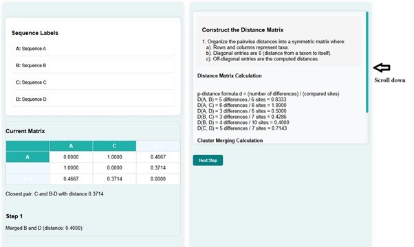
&nbsp;

&nbsp;

 
  
11. Click on the next button.

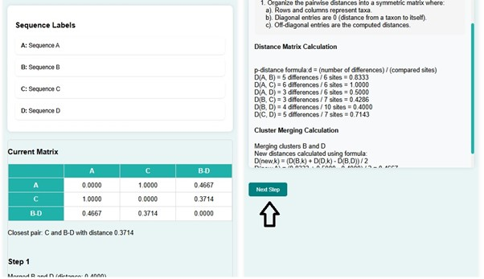
&nbsp;

 
12. In the next step, C and B-D get merged with a distance of 0.3714 and create a new distance matrix. At the same time, a phylogenetic tree is constructed for the matrix created. The distance matrix shows the shortest distance d(A, C-B-D) , that is 0.5476.  

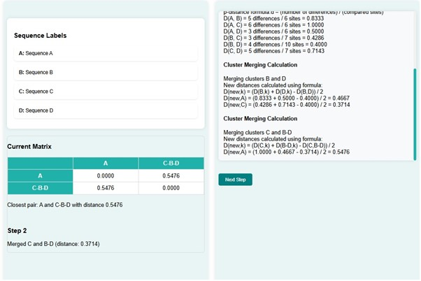
&nbsp;

 
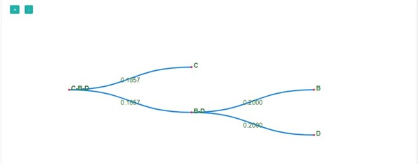
&nbsp;

 
13. Click on the next button.

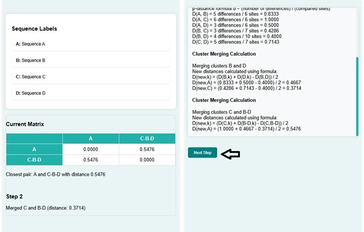
&nbsp;

  
14. Here  A and C-B-D with distance get merged with distance 0.5476. The new distance matrix has the distance d(A-C-B-D, A-C-B-D) = 0.

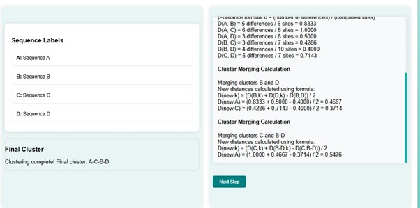
&nbsp;

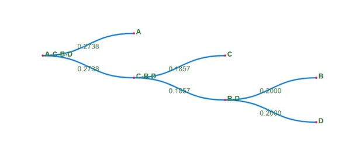
&nbsp;

 
  
The phylogenetic tree is constructed that shows the evolutionary relationship between the sequences from the calculated distance matrix in each step.

